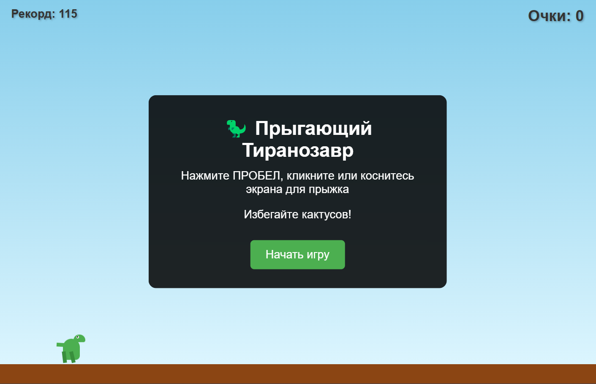
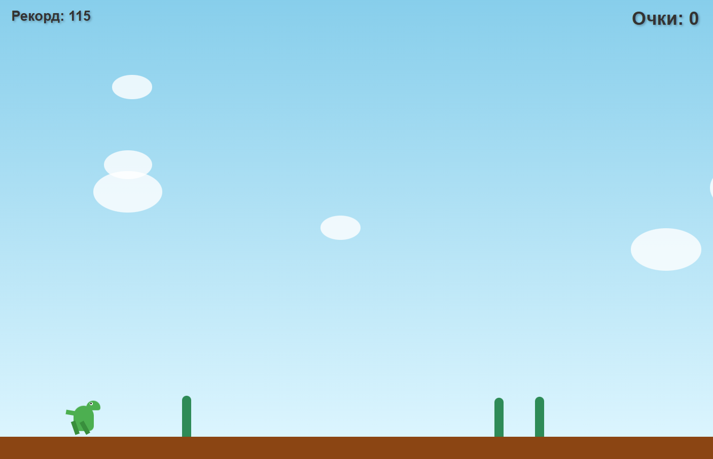
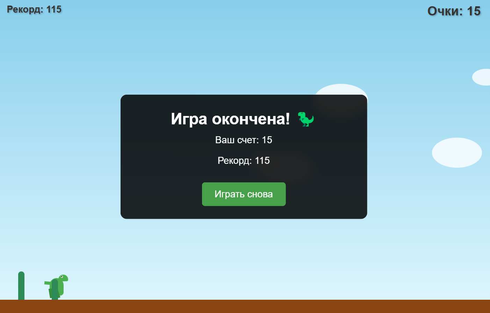

# DinoTheGame

## Работа с ИИ
Использован deepseek — на создание игрового движка ушло 44 минуты, на доработку визуальной части 45 минут
Без ИИ на допиливание интерфейса и калибровку физики и баланса 35 минут, на доработку визуала 22 минуты

## DinoTheGame описание
Динозаврик бежит на встречу судьбе, прыгая от кактусов на встречу светлому дню...
По пробелу или клику мышью мы можем перепрыгнуть препядствия, по нажатию Enter перезапустить прохождение, после поражения.
Цель - продержаться как можно дольше, поэтому перерыв только после проигрыша.

## Примечание
Может быть надо было делать через canvas элемент, но мне кажеться и так довольно неплохо получилось.
onclick через addEventListener переделывать не стал, как ИИ выдал, оставил, в данном случае не критично.

